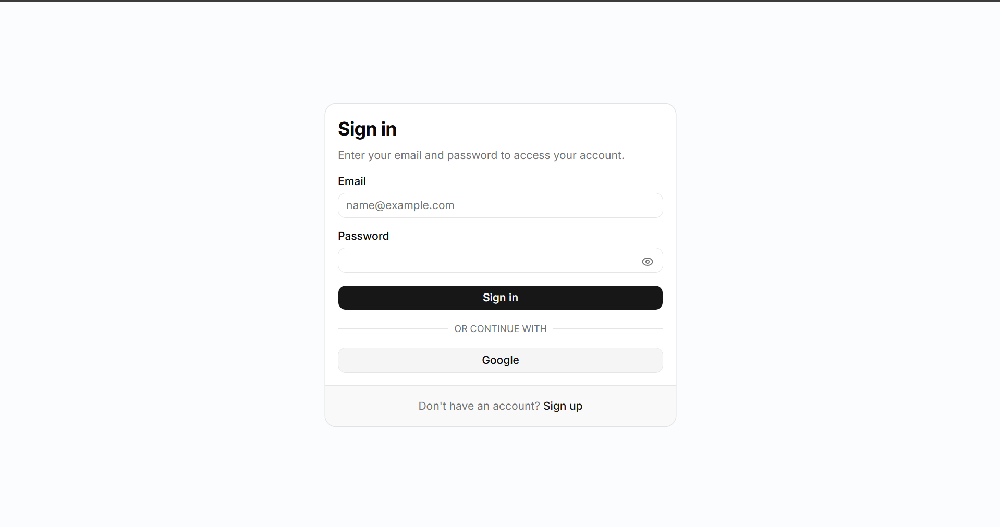
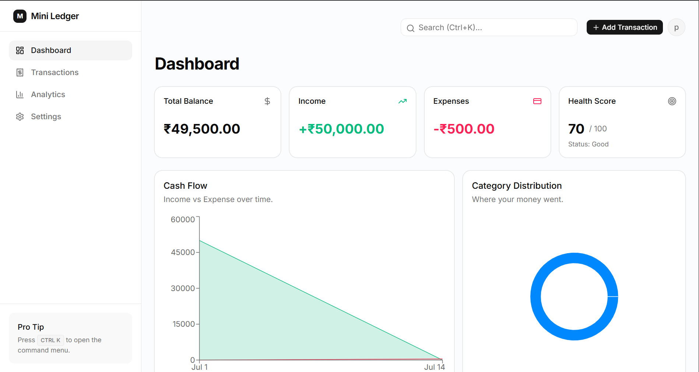
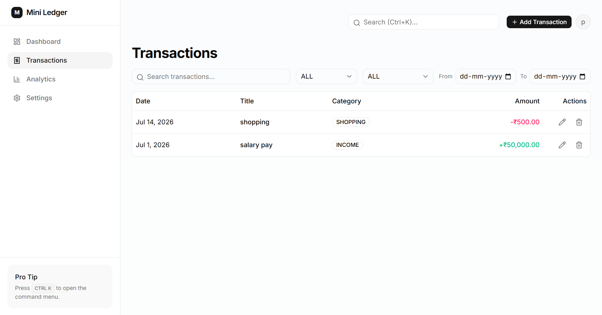
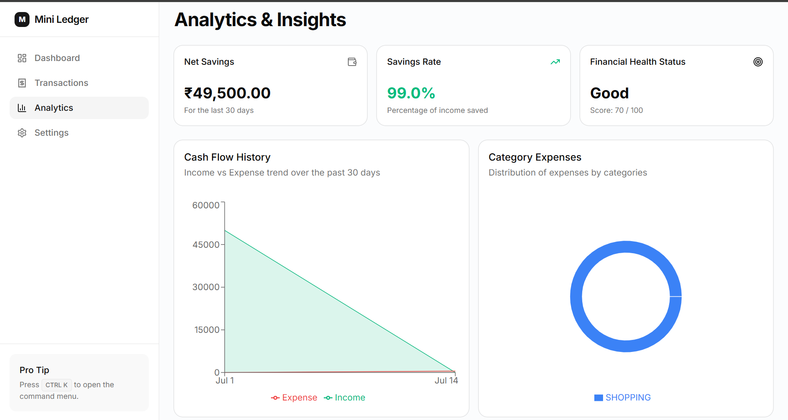
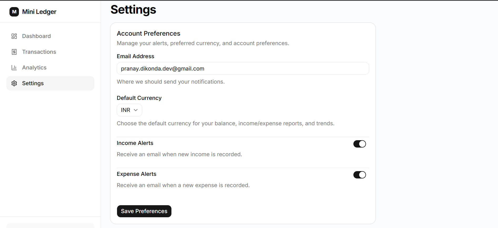

# 💰 Smart Mini Ledger

> A production-grade, multi-user SaaS personal finance dashboard built with **Next.js 15**, **Prisma**, **PostgreSQL**, and **TypeScript**.
> Designed to go beyond a simple CRUD application by focusing on **engineering quality, user experience, performance, and thoughtful product features**.

live deployed link :  https://mini-ledger-dev.vercel.app

---

## 📸 Preview

* Login

* Dashboard

* Transactions

* Analytics

* Settings

* PWA Installation

---

# ✨ Features

### 🔐 Authentication

* Google OAuth
* Email & Password Authentication
* Protected Routes
* User-specific data isolation
* Secure session management

---

### 💳 Transaction Management

* Create Transactions
* Edit Transactions
* Delete Transactions
* Search Transactions
* Advanced Filters
* Pagination
* Optimistic UI Updates

---

### 📊 Dashboard

View your financial overview with:

* Current Balance
* Total Income
* Total Expenses
* Savings
* Monthly Overview
* Recent Transactions
* Recent Activity

---

### 📈 Analytics

Interactive analytics powered by Recharts:

* Income vs Expense
* Monthly Spending Trend
* Category Distribution
* Weekly Expense Overview
* Spending Timeline

---

### 🧠 Smart Insights Engine *(Unique Feature)*

Instead of static dashboards, Smart Mini Ledger analyzes your transaction history and generates personalized insights such as:

* Highest Spending Category
* Largest Expense
* Largest Income
* Average Daily Spending
* Average Monthly Spending
* Weekend vs Weekday Spending
* Spending Streaks
* Monthly Spending Prediction
* Savings Recommendations
* Spending Trend Analysis

Example insights:

> • You spent **42%** of your expenses on **Food**.

> • Your spending increased **18%** compared to last month.

> • You're projected to spend **₹32,400** this month.

> • Great job! Your savings rate is **31%**.

---

### ❤️ Financial Health Score *(Unique Feature)*

A custom scoring algorithm evaluates your overall financial health using:

* Savings Rate
* Expense Ratio
* Spending Consistency
* Monthly Trends
* Category Distribution

Example:

```
Financial Health Score

86 / 100

Excellent

Recommendations

✓ You're saving consistently.

✓ Food expenses increased 12%.

✓ Projected month-end savings: ₹17,500.
```

---

### 📧 Email Notifications

Receive email notifications whenever a transaction is created.

Notifications include:

* Transaction Type
* Amount
* Category
* Current Balance

Email delivery is asynchronous to ensure a fast user experience. Failed deliveries are logged without interrupting transaction creation.

---

### 📝 Activity Timeline

Every important action is recorded:

* Transaction Created
* Transaction Updated
* Transaction Deleted
* Login
* Logout
* Email Notification Sent
* Email Notification Failed

---

### ⚙️ Settings

Customize your experience:

* Currency Preference
* Notification Email
* Income Notifications
* Expense Notifications

Supported currencies:

* ₹ INR
* $ USD
* € EUR
* £ GBP

---

### 📱 Progressive Web App (PWA)

Install Smart Mini Ledger like a native application.

Features:

* Installable
* Mobile Friendly
* Fast Loading
* Offline Asset Caching
* Native App Experience


---

### ⌨️ Productivity Features

Keyboard shortcuts:

* **Ctrl + K** → Command Palette
* **N** → New Transaction
* **Esc** → Close Dialog

---

### 🎨 Production Polish

* Responsive Design
* Loading Skeletons
* Empty States
* Error Boundaries
* Retry Buttons
* Toast Notifications
* Accessible Components
* Smooth Animations
* Premium UI using shadcn/ui

---

# 🏗️ Tech Stack

| Category         | Technology              |
| ---------------- | ----------------------- |
| Framework        | Next.js 15 (App Router) |
| Language         | TypeScript              |
| Database         | PostgreSQL              |
| ORM              | Prisma                  |
| Authentication   | Auth.js (NextAuth v5)   |
| UI               | Tailwind CSS v4         |
| Components       | shadcn/ui               |
| Forms            | React Hook Form         |
| Validation       | Zod                     |
| Charts           | Recharts                |
| State Management | TanStack Query          |
| Notifications    | Nodemailer              |
| Deployment       | Vercel + PostgreSQL     |

---

# 🏛️ Architecture

```
Browser
      │
      ▼
 Next.js 15 (App Router)
      │
      ├── Server Components
      ├── Client Components
      ├── Route Handlers
      │
      ▼
 Prisma ORM
      │
      ▼
 PostgreSQL
```

---

# 🗄️ Database Structure

```
User
 │
 ├── Transactions
 │
 ├── Notification Settings
 │
 └── Activity Log
```

---

# ⚡ Engineering Decisions

This project intentionally goes beyond a standard CRUD application.

Key engineering improvements include:

### Integer-Based Currency Storage

Money is stored using the smallest currency unit instead of floating-point numbers to avoid precision errors.

---

### Unified Dashboard API

A single dashboard endpoint aggregates:

* Summary Cards
* Charts
* Activity Timeline
* Smart Insights

This minimizes client requests and improves performance.

---

### Async Email Processing

Email notifications are dispatched asynchronously.

If SMTP fails:

* Transaction still succeeds.
* Failure is logged.
* User experience remains unaffected.

---

### Optimistic UI

Transactions update instantly while the server request runs in the background, creating a smoother experience.

---

### Smart Caching

Dashboard responses are cached and automatically invalidated whenever transactions change.

---

### Feature-Based Architecture

The application is organized by features rather than file types, improving scalability and maintainability.

---

# 🔒 Security

* Protected Routes
* Session Authentication
* Password Hashing
* User Data Isolation
* Server-side Validation
* Zod Input Validation
* Secure Environment Variables

---

# 🚀 Setup

Clone the repository

```bash
git clone <repository-url>

cd smart-mini-ledger
```

Install dependencies

```bash
npm install
```

Configure environment variables

```env
DATABASE_URL=

AUTH_SECRET=

AUTH_GOOGLE_ID=

AUTH_GOOGLE_SECRET=

SMTP_HOST=

SMTP_PORT=

SMTP_USER=

SMTP_PASS=

SMTP_FROM=
```

Generate Prisma Client

```bash
npx prisma generate
```

Run migrations

```bash
npx prisma migrate dev
```

Start development server

```bash
npm run dev
```

---

# 🌐 Deployment

Frontend:

* Vercel

Database:

* PostgreSQL

Environment Variables:

* DATABASE_URL
* AUTH_SECRET
* AUTH_GOOGLE_ID
* AUTH_GOOGLE_SECRET
* SMTP_HOST
* SMTP_PORT
* SMTP_USER
* SMTP_PASS
* SMTP_FROM

---

# 🤖 AI Usage

This project was intentionally built using AI as an engineering accelerator rather than as a replacement for software engineering.

### AI Tools Used

* ChatGPT
* Cursor AI / Claude Code (AI IDE)

### AI Accelerated

* Initial project scaffolding
* CRUD boilerplate
* Form generation
* UI scaffolding
* Prisma schema drafts
* Validation boilerplate
* Component generation

---

## Where AI Fell Short

Several AI-generated implementations were intentionally refactored and improved:

### Money Representation

AI initially suggested floating-point values for currency.

This was replaced with integer-based currency storage to eliminate precision issues.

---

### Dashboard Architecture

AI generated multiple API requests for analytics.

This was redesigned into a single aggregated dashboard endpoint to reduce network overhead.

---

### Email Notifications

AI generated synchronous email sending.

This was redesigned to execute asynchronously, preventing SMTP latency from impacting user interactions.

---

### Component Structure

AI generated repetitive UI components.

These were refactored into reusable feature-based components and shared utilities.

---

### Validation

AI duplicated validation logic across the application.

Validation was centralized using Zod schemas and shared utility functions.

---

### Performance

AI-generated queries were optimized using server-side aggregation, caching strategies, and efficient data fetching patterns.

---

# 🎯 Why This Project Stands Out

Beyond the assignment requirements, this project includes:

* Multi-user Authentication
* Financial Health Score
* Smart Insights Engine
* Activity Timeline
* Progressive Web App (PWA)
* Currency Preferences
* Async Email Notifications
* Unified Dashboard API
* Optimistic UI
* Feature-Based Architecture
* Responsive SaaS UI
* Production-Ready Code Structure

These additions demonstrate engineering decisions focused on scalability, performance, maintainability, and user experience rather than relying solely on AI-generated CRUD functionality.

---

# 🔮 Future Improvements

* CSV Import with row validation
* Recurring Transactions
* Budget Planning
* Goal Tracking
* AI-powered Spending Assistant
* Multi-currency Exchange Rates
* Scheduled Reports
* Push Notifications
* Family/Shared Accounts
* Receipt OCR Integration

---

# 📄 License

This project was developed as a technical assessment and portfolio project demonstrating modern full-stack engineering practices.
